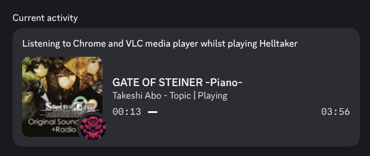

# HD Presence



HD Presence is a highly configurable Discord activity provider for Linux.  
It provides more detailed activities than Discord does by default and implements game and app activities for unsupported applications.  
The format of the activity is highly configurable, ie:  
```toml
[mpris_handler.activity_format]
# Activity template keys:
# {name} - The name of the current media player
# {title} - The name of the current track
# {artist} - The artist of the current track
# {status} - The status of the track, one of Playing,Paused,Stopped
# {url} - A url to the track or to search for the track
# {cover_url} - A url to the uploaded cover art of the track (will be empty if upload_cover is false)
name = "{name}"
details = "{title}"
details_url = "{url}"
state = "{artist} | {status}"
state_url = ""
status_display_type = 2
large_image = "{cover_url}"
large_image_text = ""
large_image_url = ""
small_image = ""
small_image_text = ""
small_image_url = ""
buttons = []
```

## Features
- Suports multiple activities at a time ("listening to abc whilst playing xyz" and "playing abc and xyz")
- Highly-configurable activity format
- Supports generic applications (works best on KDE 6+)

## Supported Handlers
- `mpris_handler` - Handles `mpris` media
- `steam_handler` - Handles games launched via Steam
- `process_handler` - Configurable handler that'll set a status based on your processes (intended to work under KDE)

## Process Handler Caveats
- Process handler by default works only on KDE as it uses KWin's scripting API to get window PIDs
- To use the process handler on non-KDE DEs set an explicit process `whitelist` in the configuration file

## Troubleshooting
### The progress reported by MPRIS whilst watching YouTube is wrong
This is a bug in Chrome/YouTube itself, the following extension fixes it: [https://github.com/LurkAndLoiter/youtube-mpris-fix](https://github.com/LurkAndLoiter/youtube-mpris-fix)